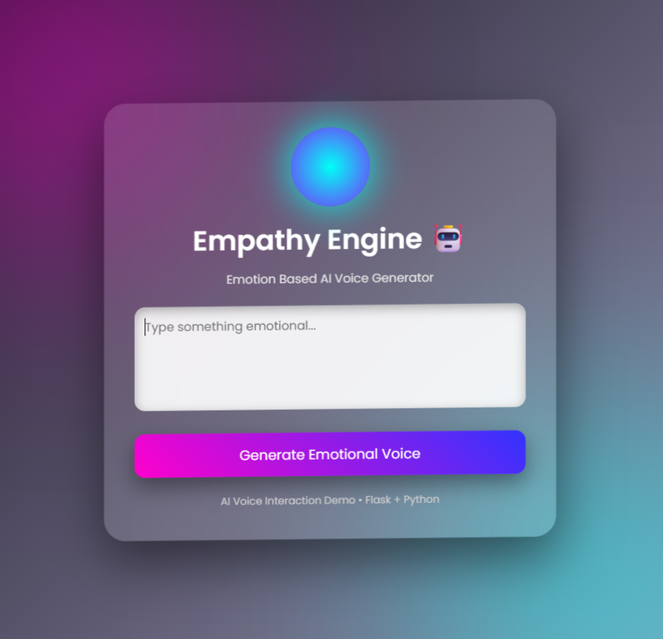
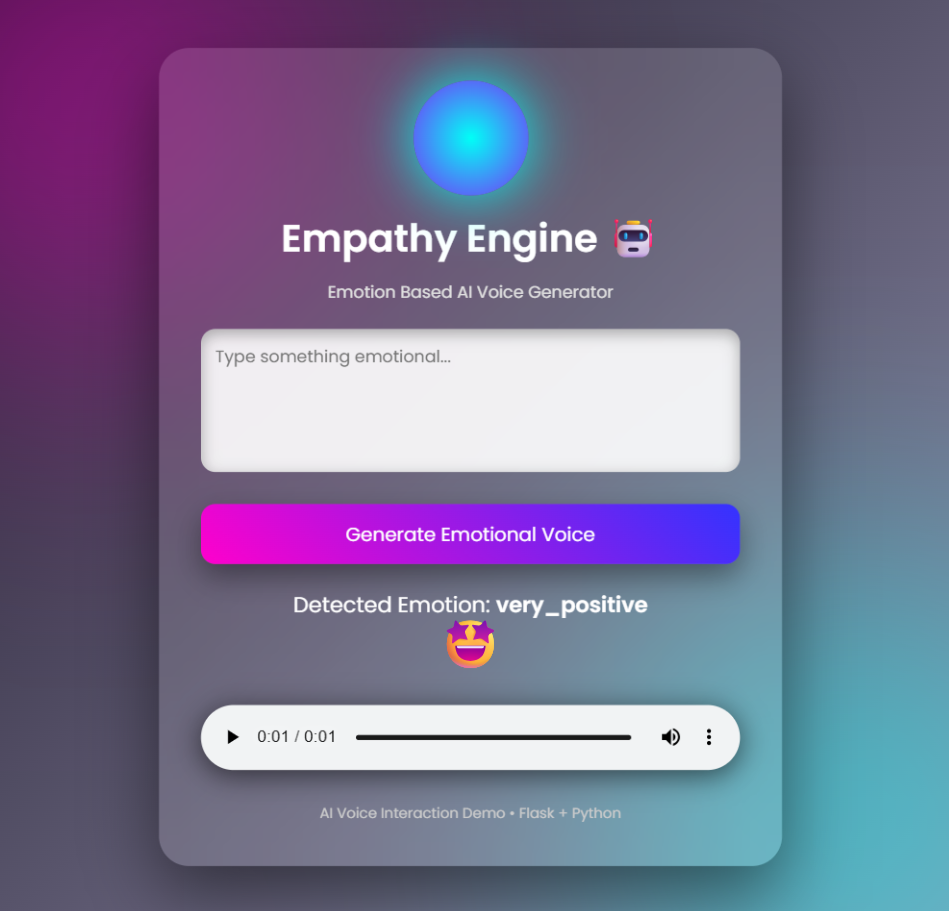

# 🤖 Empathy Engine – Emotion Based AI Voice Generator

Empathy Engine is an AI-powered application that converts text into emotionally expressive speech.
The system detects the emotional sentiment of the input text and dynamically modulates speech parameters to produce natural and human-like audio output.

Unlike traditional monotonic text-to-speech systems, this project attempts to bridge the emotional gap in AI voice interaction by adapting voice delivery according to the detected emotion.

---

# 🚀 Features

• Emotion Detection using **VADER Sentiment Analysis**
• Emotion Intensity Classification
• Emotion-based Speech Generation
• Human-like Voice Output using **ElevenLabs AI Voice**
• Beautiful Animated UI with Glassmorphism Effects
• Emoji-based Emotion Visualization
• Real-time Audio Playback in Browser
• Flask-based Web Application
• Modular and Clean Project Architecture

---

# 🧠 How It Works

The system follows a simple AI pipeline:

Text Input → Emotion Detection → Emotion Mapping → Voice Generation → Audio Playback

### Step 1 – User Input

The user enters text into the web interface.

### Step 2 – Emotion Detection

The text is analyzed using **VADER Sentiment Analysis**, which produces a compound sentiment score.

### Step 3 – Emotion Classification

Based on the sentiment score, the text is classified into one of the following emotions:

• Very Positive
• Positive
• Neutral
• Negative
• Very Negative

### Step 4 – Voice Modulation

Speech parameters such as speech rate and intensity are adjusted based on the detected emotion.

### Step 5 – Audio Generation

The system generates an audio file using a Text-to-Speech engine and saves it as:

static/output.mp3

### Step 6 – Audio Playback

The generated audio is played directly in the browser.

---

# 🏗️ Project Architecture

```
empathy-engine
│
├── app.py
├── emotion.py
├── tts.py
├── requirements.txt
│
├── templates
│     └── index.html
│
├── static
│     └── output.mp3
│
└── README.md
```

### app.py

Main Flask server responsible for routing and connecting all modules.

### emotion.py

Handles emotion detection using the VADER sentiment analysis model.

### tts.py

Responsible for generating speech output using the text-to-speech engine.

### templates/index.html

Frontend user interface containing animations and interactive elements.

### static/

Stores generated audio files.

---

# 🛠️ Technologies Used

### Backend

• Python
• Flask

### AI / NLP

• VADER Sentiment Analysis

### Voice Generation

• pyttsx3 (Offline TTS)
• ElevenLabs (AI Voice)

### Frontend

• HTML
• CSS
• Glassmorphism UI
• Animations and Effects

---

# 📦 Installation

Clone the repository:

```
git clone https://github.com/YOUR_USERNAME/empathy-engine.git
```

Navigate to the project folder:

```
cd empathy-engine
```

Install dependencies:

```
pip install -r requirements.txt
```

Run the application:

```
python app.py
```

Open in browser:

```
http://127.0.0.1:5000
```

---

# 🖼️ Project Screenshots

## Main Interface



## Emotion Detection Result



To add screenshots:

1. Create a folder named:

```
images
```

2. Place your screenshots:

```
images/image1.png
images/image2.png
```

---

# 📊 Emotion Mapping Logic

| Sentiment Score | Emotion       |
| --------------- | ------------- |
| ≥ 0.5           | Very Positive |
| 0.1 – 0.49      | Positive      |
| -0.1 – 0.1      | Neutral       |
| -0.49 – -0.1    | Negative      |
| ≤ -0.5          | Very Negative |

---

# 🔌 API Endpoint (Optional Feature)

Example API endpoint:

```
POST /api/emotion
```

Request:

```
{
"text": "I am very happy today"
}
```

Response:

```
{
"text": "I am very happy today",
"emotion": "very_positive",
"audio": "static/output.mp3"
}
```

---

# 🎯 Use Cases

• AI Assistants
• Customer Support Bots
• Emotionally Aware Chatbots
• Accessibility Tools
• Voice Interaction Systems

---

# 🔮 Future Improvements

• Real-time microphone input
• Speech emotion detection
• Emotion waveform visualization
• Multi-language support
• Voice style customization
• AI avatar integration

---

# 👨‍💻 Author

Developed by **[Apoorva Singh]**

B.Tech Student | AI & Web Development Enthusiast

---


